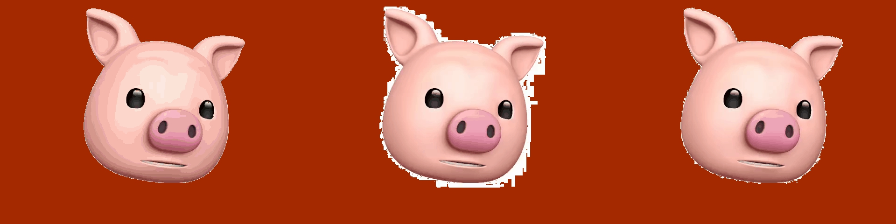

↓ Logo@3.8MB 

Animoji to GIF | PNG to transparent GIF

## Description

This project aims to provide an one-touch way to generate static/animated GIF with transparent background that could be used in WeChat and other GIF based emoticon chat APP. It also partially supports APNG and WebP outputs with external libs.

People love to use animations, emojis and emoticons in daily chatting to express their various feelings more vividly. The problem is, there is still not a good solution to send high quality emoticons. 

Emoji is a good makeshift. It use extended Unicode characters to represent a variety of common seeings, including but not limited to facial expressions, actions, animal, plants, places, transportation and many more. However, as it keeps on evolving, newer code-s are not included in previous versions and compatibility issues come up. Also, different company intepret those code into differently designed icons. Apple and Google are not the same, nor is Microsoft. 

Modern animated image formats including webp, apng, BPG and other solutions like css+svg are great both in quality and size. The problem also comes from (profit driven) compatibility. Chrome support WebP developed by Google, Firefox supports its own APNG. IE and Edge support neither. Animated CSS are beautiful and flawless due to its vertorgraph intrinsicality, but could not deploy to places where frontend techs cannot be supported (luckily, modern APP are gradually walking into webAPP mode).

So until 2018, animated GIF with GIF89a is still popular among WWW. Though IMGUR have transcoded its GIFs into webm and webp, there are still sites who live on GIF, e.g. Giphy, Gfycat, 4GIFs.com, etc. Much worse, even some top-notch companies in the industry do not support webp or apng. APNG uploaded will be single framed, and webp-s are not even allowed!

This repo provides a easy way to generate GIFs with transparent background. There exists several tools but no one suit my needs. They are either not so customizable or not efficient. PhotoShop could do all the work, but with great effort(and great price!).

Still in develop before a sound release. Projected outcome:

- High: with CLM and 3D tech, mimicking Animoji to design a web-based Omnimoji generator that could generate customized animations with efficiency and quality.

- Medium: Wrap-up the project, deals with all sorts of formats and generate satisfactory animations.
Probably do a GUI with PyQt. (why the hell people start to use js as primary GUI PL?!)

- Low: wrap-up the project with adequate docstring and defined callbacks.

## Features

The tool has multiple features, including:

-	read from static images including .jpg, .png and .gif(single frame) and generate single frame GIF with transparent background. (no .png output since its no need)

-	read from h264 .mp4/.mov video file and generate animated GIF with transparent background, or .apng with alpha

-	read from animated GIF and remove its background

-	add text on frames

-	multiple optimization method provided with PIL and external libs

### Features to add

-	better robustness: read file format, read image, error handling, optimization, etc. 

-	save as video with alpha

-	.webp support

-	omnimoji support

-	(if needed)Cython optimization

-	more text style and font support, e.g. sine waving, z-axis movement, color change

-	filters, e.g. mosaic, add contrast, auto-adjust, white balance

-	multiple layers to remove.

-	remove first frame preview and rewind

-	add to pixel based multiprocessing addition to frame based

## Versions

### 20180806

- added first version.

## Usage

0. Python3, PIL, matplotlib, *(imageio and ffmpeg for video files), *(external libs for further optimization and apng support)

### Easy step

1. run the main.py. drag the file into the console, click on the background color to remove(contiguous). get the output under designated output folder. (default under ./output of main.py) send it, **COUP DE GRACE!**

### Pro Tips

1. config file

	-	crop: control the crop region only for video cropping in step 2. use with crop box before main.

	-	caption_text: currently add text to all the frames. set postion by clicking on the spot of upperleft corner of text in step3 rid background.

	-	additional_args: for gifsicle optimization, read the doc of it.

	-	tolerance: tolerance of color to rip the background.

others are literally understandable.

2. there might be a few settings written in the code. change them with caution.

3. help me to build it with PRs!

## Keywords

tool | GIF | transparency | transparent background | python | PIL | 斗图 | animoji | emoji | emoticon

## Refs

I've exported the links that I have referred to @180806. please check below. no more would be added.

[Bookmarks of all the ref links](./refs/bookmarks_2018_8_5.html)

## Credits

- [PIL](https://github.com/python-pillow/Pillow)

for image related manipulation.

- [Gifsicle](https://github.com/kohler/gifsicle)

for GIF further optimization with lossy LZW and color reduction.

- [APNG Assembler](http://apngasm.sourceforge.net/)

for APNG support.

---

## 具体实现介绍

[博文](https://yo1995.github.io/coding/ultimate-emoticon-generator-1)

### step2 读取视频文件

FFmpeg大法好

### step3 文字遮罩层

最初做的是文字表情包生成器，因此在这方面有一定了解。

GIF由于只支持单个透明通道，导致其边缘效果较差。一般的解决方案是包裹白色描边、加入抖动或减少曲线。

我采用的是描边的办法，通过多次重绘减少棱角和毛刺的出现，以达到更好的视觉效果。

### step3 去背景

整个程序的核心。事实上，如PS、AE等软件在静态和动态画像自动去除背景的算法上已经做得非常完善，且效率很高，在视频直播中都能轻松实现。我没有查找它是如何实现的，而是通过自己分析写出来的。写完后再一查发现这种方法已经有名字了……floodfill 🤦‍♂️ 写完以后发现有类似的函数实现，但效率没有我的好，准备提个PR

从左至右RGBA，RGB，RGB->P，可以看出RGBA有明显色阶断层，后面二者画质接近，一个边缘有问题，另一个丢失了一个颜色。后续优化改进了这些问题。~~转为128色后画质算个P~~

另一个问题是如何保持GIF的画质同时去除背景（虽然GIF没有什么画质可言，但还是可以通过local palette/dispose method/dither来改善一些）。首先尝试直接把RGBA转化为色板模式，但发现出现了色阶断层。转成RGB再转色板则会导致色板键值匹配出现问题。最后的解决方案参见代码，大致是floodfill背景为透明色，将图像转为色板模式，再将透明色涂成色板中预留的透明通道。另外，猜测由于转为RGB的预设并非100%画质，导致转换后需要增加一定容差才能与直接RGBA转换所得的图像具有类似精细的边缘。

在实现之前还尝试用Cython和numpy提升运行效率，但都以失败告终。或许对于低分辨率的多帧小图而言顺序执行反而效率最高。

### step5 优化

通过附加库实现。GIF如果完全手工制作可以达到最好的压缩效果，但为了更为快捷简便还是使用程序预置了。
